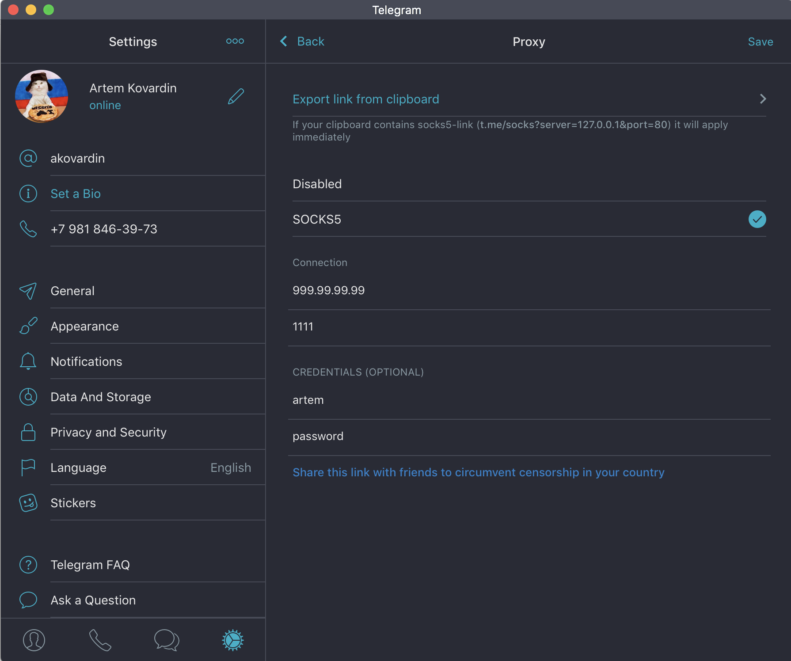

# s5go

Простой socks5 сервер который можно запустить на [digitalocean](https://m.do.co/c/a8946222ec7d) и радоваться

## Настройка

Нужно переименовать example.toml в config.toml и добавить нужных пользователей

```toml
port = 1111

[[users]]
user = "user1"
pass = "pass1"

[[users]]
user = "user1"
pass= "pass1"
```

Пример использования в Telegram



## Деплой

Для деплоя в папки ansible есть готовый плейбук. нужно добавить свой инвентори (файл hosts) вида

```
[s5go]
99.99.99.99
```

И запускать деплой командой:

```
ansible-playbook -i hosts s5go.yml
```

